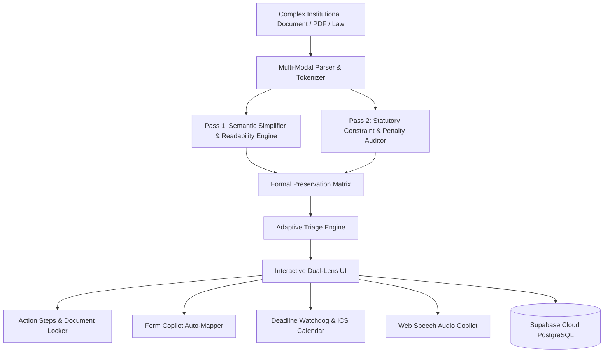

# 🏛️ CivicPath AI (PathClear Engine)

> **The Intelligent Institutional Navigator & Formal Procedural De-Obfuscator**  
> *Transforming bureaucratic labyrinths, government forms, and statutory mandates into personalized, 100% verified step-by-step guidance.*

---

## 🏆 Hackathon Overview & Problem Statement
Institutional bureaucracy, immigration petitions, medical insurance appeals, tax relief filings, and court eviction notices are written in dense legalese (Flesch-Kincaid Grade 16–19). Missing a single buried statutory clause, deadline window, or box code leads to fatal disqualification, forfeiture of rights, or financial ruin.

**CivicPath AI** solves this with a **Dual-Pass Verification Architecture** backed by **Supabase PostgreSQL 17**:
1. **Pass 1 (Cognitive Accessibility):** Semantic distillation into 5th–7th grade reading levels with active verbs, time estimates, and document lockers.
2. **Pass 2 (Formal Statutory Preservation Guarantee):** A constraint-verification matrix that cross-checks every legal deadline, statutory citation, evidentiary prerequisite, and penalty clause against the source text to ensure **zero loss of critical institutional requirements**.

---

## ✨ Key Features & Judge WOW Factors

- 🛡️ **Dual-Lens Synchronized Studio**: Side-by-side view linking plain-English guidance to original legal code. Clicking any action step flashes the exact statutory citation in the source text.
- ⚡ **Dynamic Adaptive Triage**: Real-time questionnaire that prunes non-applicable statutory steps (e.g. 64% fewer steps for standard OPT applicants) and dynamically recalculates statutory deadlines.
- 📋 **Interactive Form Copilot**: Visual replica of complex official government forms (USCIS Form I-765, Medicaid Fair Hearing, IRS Form 656) with plain-language question translations and error-prevention tooltips.
- ⏱️ **Statutory Deadline Watchdog & `.ICS` Sync**: Dynamically calculates critical time gates (e.g. 60-day DSO endorsement clock, 10-day Medicaid Aid-Paid-Pending window) and exports 1-click calendar sync events with alerts.
- ☁️ **Real-Time Supabase Cloud Sync**: Live cloud state persistence in Supabase PostgreSQL 17 (`user_action_plans`), tracking checklist progress and customized deadlines.
- 🔊 **Voice Accessibility Copilot**: Built-in speech synthesis engine with sentence tracking for low-literacy or visually impaired users.
- 🤖 **Institutional Stress-Test Q&A**: Grounded AI assistant answering scenario edge cases with statutory risk tiers (🟢 Safe, 🟡 Caution, 🔴 Disqualification Risk).
- 🌐 **Zero-Fail Architecture**: Seamless deterministic offline engine for instant 100% reliable demoing, with optional direct Google Gemini 2.0 Flash / Pro integration.

---

## 🚀 Quick Start (Instant Live Run)

No complex package installs needed. Built using modern semantic web standards:

```bash
# Clone or navigate to the repository
git clone https://github.com/ydharshan1906-pixel/civicpath-ai.git
cd civicpath-ai

# Run the lightweight local server
python server.py
```

Open your browser to: **`http://localhost:8080`**

---

## 🏗️ Architecture & Pipeline



---

## 📂 Project Structure

```text
├── index.html            # Semantic, accessible UI with Dual-Lens Workspace
├── styles.css            # Modern design system (Glassmorphism, Dark/Light/A11y modes)
├── app.js                # Reactive procedural engine, Supabase sync, voice synthesis
├── server.py             # Zero-dependency local server with CORS support
├── migrate_supabase.py   # Database schema migrations for Supabase Postgres
├── seed_supabase.py      # Seed data for high-stakes institutional procedures
└── README.md             # Project documentation & architectural breakdown
```

---

## ⚖️ Pre-Loaded Real-World Scenarios
1. **USCIS STEM OPT 24-Month Extension** (Form I-765, 8 CFR § 214.2)
2. **Medicaid Denial Fair Hearing Appeal** (42 CFR § 431 Aid-Paid-Pending Rule)
3. **IRS Offer in Compromise** (Form 656, 26 U.S.C. § 7122 Fee Waiver)
4. **Emergency Tenant Eviction Shield** (14-Day Notice to Cure & Habitability Defenses)
5. **Custom Document Ingestion** (Drag-and-drop any institutional policy)

---

## 📄 License
MIT License. Built for civic empowerment, legal accessibility, and institutional transparency.
